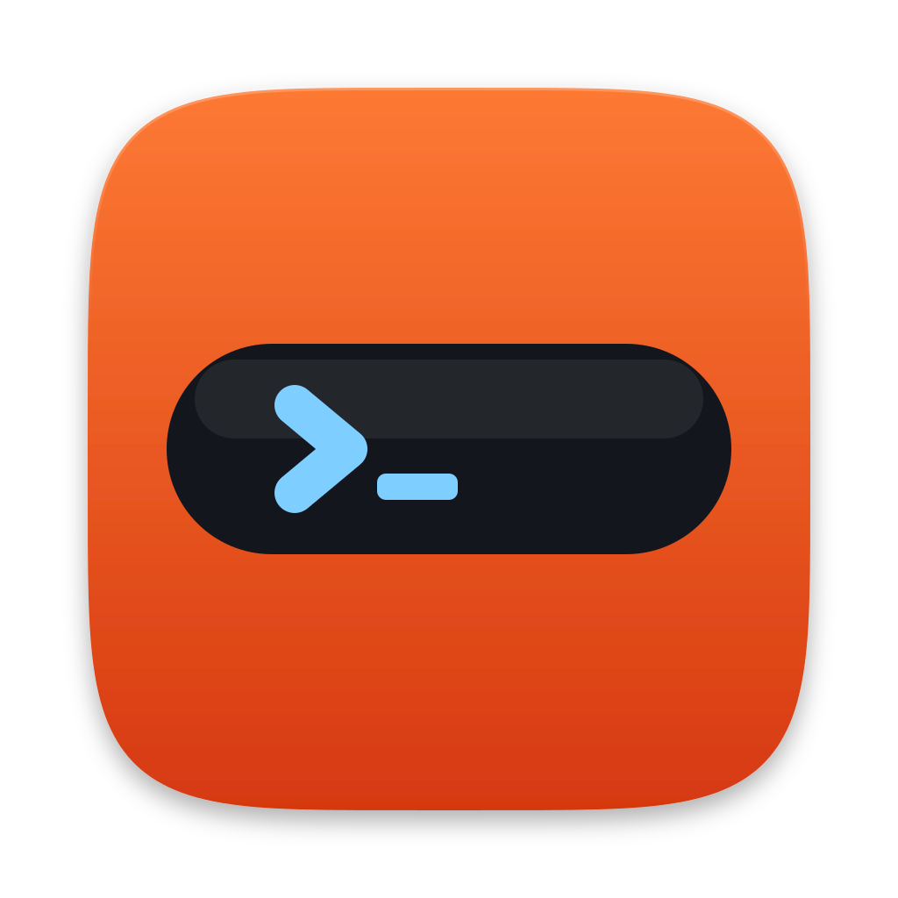

<p align="center"></p>

# CodePit

**A pit wall for your coding agents.**

CodePit runs Claude Code, Codex and Google Antigravity side by side, ranks every
session by whether it needs you right now, and lets you hand a conversation from
one agent to another when a quota runs out. It talks to the agents over the open
[Agent Client Protocol](https://agentclientprotocol.com) (ACP), so it sees real
protocol events (an approval request, a question, a turn ending) rather than
guessing from transcripts.

Like a race team's pit wall, it watches every car on track and calls in the one
that needs you.

> **Not affiliated with Anthropic, OpenAI or Google.** A personal project that
> works *with* their coding agents. Product names are used only to say which
> agents it drives.

**Runs on your machine.** The server listens on `127.0.0.1` by default, opens
only in the CodePit app on that machine, and keeps its state in `~/.codepit/`. The agents themselves talk to their vendors exactly
as they would in your terminal, using your existing logins.

---

## Features

### Agents
- **Claude Code, Codex CLI and Google Antigravity** in one window, each signed in
  the way you already are: your Claude Max/Pro login, your ChatGPT login for
  Codex, your Antigravity sign-in. API keys are optional.
- **Switch agent mid-conversation.** Hand over a summary, the recent messages, or
  nothing, either in the same session or as a fork. The handover carries the
  folder, branch, uncommitted files and the current goal.
- **Switching back continues where that agent left off.** Each agent's own
  session is kept aside, and on return it is caught up only on the turns it
  missed, told which other agents answered meanwhile.
- **Continue an existing Claude or Codex conversation.** The New session dialog
  lists the transcripts already on disk for the chosen folder.
- **Model and effort pickers** built from what each agent advertises: reasoning
  effort, context window size (`opus[1m]`), fast mode, Claude's `ultrathink` and
  `ultracode`, favourite models, a *New* badge on models seen for the first time,
  and a custom model id that sticks.

### Attention ranking
- Sessions sort into **Needs you / Working / Parked / Idle / Snoozed**, with
  *blocked* (an approval or question waiting) above everything else and
  *crashed* close behind.
- **Every position is explained.** *Why it ranks here* lists each factor and its
  points: state, priority, pin, uncommitted files, unpushed commits, recency.
- **Working in background** is its own status: the turn ended but a shell or a
  subagent is still running, so the session is not shown as waiting on you.
- **Triage by hand when you want to:** priority (P0/P1/P2), pin, snooze for an
  hour, and a cleanup mark with its own filter. They adjust the ranking; they
  never replace it.

### Approvals and questions
- **Approvals** wait in a banner above the composer with every option the agent
  offers, including which subagent asked. *Approve and auto-approve* covers the
  rest of the session.
- **Approval modes** from the agent itself: Supervised, Auto-accept edits, Plan,
  Full access.
- **Questions arrive as forms.** Claude's AskUserQuestion and any other ACP form
  elicitation render as single or multiple choice with an *Other* box, or as
  text, number, yes/no and date fields. Answers are validated before they reach
  the agent.

### The conversation
- **Queue messages while the agent works.** Edit or remove them, or *Send now*
  to steer the running turn when the agent supports it. Stop never empties the
  queue.
- **Rewind:** undo the last turn, rewind to any message, or edit and resend.
  (This rewinds the conversation, not the files on disk.)
- **Compaction:** the agent's own compaction when it has one, a handoff summary
  when it doesn't, and *Compact when finished* above 30, 50 or 70% of the context
  window, which waits for queued messages and background work.
- **Subagents, background shells and workflows** each get a row and a focused
  view. Codex subagents stream live.
- **Inline diffs** for every edit, an activity strip with the agent's plan and
  running commands, image and file attachments (paste, drop or pick), and a slash
  menu with every command and skill the agent reports.

### Terminal and workspace
- **Agent commands** lists every command the agent ran, with its output and exit
  code. **Your shell** is a real PTY in the session's folder, in the same window.
- **Git awareness:** branch, uncommitted files and unpushed commits in the
  header, feeding the ranking.
- **Start anywhere:** type a path, browse inline, pick a recent folder, or use
  the macOS folder picker.
- **Search the conversations,** not only titles: messages, reasoning and command
  output, from the command palette (`⌘K` or `/`).

### MCP servers and plugins
- **Configure once, use with every agent.** stdio, streamable HTTP and SSE
  servers, scoped to all agents or one, with secrets masked after saving and
  `${workspace}` replaced by the session's folder.
- **Test connection** runs the MCP handshake and lists the server's tools.
- **One-click catalog:** Filesystem, GitHub, Memory, Brave Search, SQLite,
  PostgreSQL.
- **Antigravity too:** its servers go into `agy`'s own MCP settings, kept in step
  with the dialog (see [Supported agents](#supported-agents)).
- **Read-only view of what each agent loads by itself:** Claude Code plugins
  and skills, Codex plugins and skills, Antigravity plugins and MCP servers.

### Usage
- Claude's 5-hour, weekly and per-model limits and Codex's plan limits, with
  reset times. Each session also gets a cost estimate and a context-window meter.

### Phone and other devices
- **LAN access** is off by default and turned on from the app without a
  restart. Each phone or computer is paired once, by scanning a QR code or typing
  the code it shows, and can be revoked on its own.
- **Add to Home Screen** on a phone for a standalone app with its own layout.

### Mac app
- A packaged Electron app with the server inside it. Quitting asks first when
  agents are running, and the next message resumes each agent's own session.
- `npm run install:mac` installs the build you just made (see [Install](#install)).

---

## Coming from Claude Terminal

CodePit grew out of [Claude Terminal](https://github.com/ritwik-g/claude-terminal),
which ranks Claude Code sessions by attention by reading Claude Code's transcripts
under `~/.claude/`. CodePit rebuilds that idea on ACP, which is what makes the
other agents possible. Not everything has come across yet.

**✅ has it · 🟡 partly · ❌ not yet**

| Feature | Claude Terminal | CodePit |
| :--- | :---: | :--- |
| Agents | Claude Code only | ✅ Claude Code, Codex, Antigravity, any ACP agent added in code |
| Switch agent, keeping the conversation | ❌ | ✅ in place or as a fork; switching back resumes that agent's own session |
| Attention groups with an inspectable reason for every row | ✅ | ✅ adds *blocked*, *crashed* and *Working in background* |
| Questions and approvals sort first | ✅ read from transcripts | ✅ native ACP requests, answered in the app (approval banner, question forms) |
| Uncommitted and unpushed work | ✅ only when it belongs to that session | 🟡 every session in a shared checkout is flagged; rows show uncommitted files only |
| Full-text search of the conversation | ✅ | ✅ |
| Start a session in any folder | ✅ | ✅ and continue an existing Claude or Codex conversation |
| Rename | ✅ runs `/rename` | ✅ CodePit's own title |
| Branch a session | ✅ runs `/branch` | 🟡 *Fork into a new session* hands over a summary instead |
| Priority, pin, cleanup mark and filter | ✅ | ✅ (pin has no `x` key) |
| Snooze | ✅ tomorrow / next week on working days, custom | 🟡 one hour only |
| *woke 41m* marker on a snooze that ran out | ✅ | ❌ |
| Tags | ✅ `t` key and tag filter | ❌ stored and searched, but no way to set them |
| Derived session types (review / errand / task / thread) | ✅ | ❌ |
| PR links, review sessions linking every PR | ✅ | ❌ |
| Artifacts a session published | ✅ | ❌ |
| Desktop notification, dock badge, unseen-finish dot | ✅ | ❌ only `(n) CodePit` in the tab title |
| Usage at a glance in the header | ✅ | 🟡 Claude and Codex limits in the Usage tab and Accounts dialog, not in the header |
| Usage alerts (80%, or before a reset) | ✅ | ❌ |
| Prompt-cache expiry warning and **Keep warm** | ✅ | ❌ |
| Lunch and end-of-day compact reminders | ✅ | ❌ |
| Context size | ✅ chip on big running rows | 🟡 meter in the open session only |
| Compaction | ✅ types `/compact` | ✅ native or summary, plus *Compact when finished* |
| Embedded terminal | ✅ the Claude Code session itself | 🟡 the agent's commands, plus your own shell per session |
| Search inside the terminal (`⌘F`) | ✅ | ❌ |
| Terminal reconnects on its own after sleep | ✅ | 🟡 the app reconnects; a terminal pane needs a click |
| Working set offered back after a quit | ✅ | 🟡 conversations persist and agents resume; shells are not reopened |
| *Active only* as the default view | ✅ | 🟡 an *Active* tab, not the default |
| List holds still under the pointer | ✅ | ❌ |
| Resizable, hideable session list | ✅ | ❌ |
| Keys `j` `k` `/` `p` `c` | ✅ | ✅ plus `⌘K` and `⌘N` |
| Keys `x` `t` `s` `r` `[` `?` | ✅ | ❌ |
| `/cleanup` hook marks the session | ✅ | ❌ |
| Token required even from this machine | ✅ | ✅ only the CodePit app gets in (a key minted at each launch); browsers on this machine are refused unless `CODEPIT_LOCALHOST=1` |
| Phone access over the LAN, per-device QR or code pairing, home-screen app | ❌ | ✅ |
| MCP server setup and catalog | ❌ | ✅ |
| Model, effort and approval-mode pickers | ❌ | ✅ |
| Queue, steer, rewind, edit and resend | ❌ | ✅ |
| Subagent and workflow views | ❌ | ✅ |
| Published releases with checksums and provenance | ✅ | ❌ build from source for now |

---

## Install

**Requires** Node.js 20.12 or newer, and at least one agent you are already
signed in to: [Claude Code](https://claude.com/claude-code),
[Codex CLI](https://github.com/openai/codex) or
[Antigravity](https://antigravity.google) (its `agy` CLI).

### macOS app (build from source)

There are no published releases yet. A build you make yourself is never
quarantined, so it opens without any Gatekeeper steps:

```bash
git clone https://github.com/ritwik-g/codepit.git && cd codepit
npm install
npm run install:mac -- --build   # build, then install to /Applications and open
```

`npm run install:mac` on its own installs the last build in `release/`. It quits
a running CodePit first (which ends any agent turns in progress), keeps the old
app until the new one is in place, and opens it. `--no-open` skips the launch;
`CODEPIT_INSTALL_DIR` installs somewhere other than `/Applications`.

To only package it: `npm run dist:mac` (dmg and zip in `release/`).

### Server in your browser (for testing)

On the computer running it, CodePit opens only in the CodePit app. A browser
there gets in only when localhost access is turned on for testing:

```bash
npm install
npm run build
CODEPIT_LOCALHOST=1 npm start   # http://127.0.0.1:7890
```

Without `CODEPIT_LOCALHOST=1`, `npm start` still serves paired phones and other
devices over the LAN. They can't be approved without the app, though, so
pairing new ones needs the flag or the app.

For development with hot reload, run `npm run dev` (server, with localhost access
on) and `npm run dev:web` (Vite, http://127.0.0.1:5280).

### Checks

```bash
npm run typecheck
npm test           # ACP, MCP, LAN, effort, compaction, agent tasks, migration, resume
npm run smoke
```

---

## Supported agents

| Agent | How it runs | Sign-in |
| :--- | :--- | :--- |
| **Claude Code** | `@agentclientprotocol/claude-agent-acp` (bundled) | Your Claude Code login (Max/Pro), or `ANTHROPIC_API_KEY` |
| **Codex CLI** | `@agentclientprotocol/codex-acp` (bundled) | Your ChatGPT login in `~/.codex`, or `OPENAI_API_KEY` |
| **Google Antigravity** | The `agy` CLI in headless mode, through an adapter in `server/agents/antigravity-agent.ts` | Your Antigravity sign-in |
| **Built-in Demo Agent** | `server/agents/mock-agent.ts`; hidden unless `CODEPIT_ENABLE_MOCK=1` | None |

**Antigravity** can't ask for approval in headless mode, so what it may do is set
up front by the approval mode (Read only, Accept edits, Plan, Full access). `agy`
takes no MCP servers per run; it reads them from one file,
`~/.gemini/config/mcp_config.json`, which every `agy` run and the Antigravity
desktop app share. CodePit keeps its servers for Antigravity in that file: it
adds, updates and removes only the entries it wrote, leaves a different server
with the same name alone and says so, skips SSE servers and ones that use
`${workspace}`, and makes the file owner-only because it then holds tokens.
`agy` only works in folders listed as trusted in its own settings.

**Other agents:** anything that speaks ACP over stdio can be added to
`server/agents/registry.ts`.

---

## LAN access

The server listens on `127.0.0.1` only. To use CodePit from a phone or another
computer, open **LAN access** in the sidebar and turn on **Allow devices on your
network**. It takes effect immediately and is remembered; turning it off
disconnects every other device at once. Only the computer running CodePit can
change it.

On the computer running it, CodePit opens only in the CodePit app. Every other
device is paired once, and only from the app:

- **QR code:** scan the code in the dialog with the phone's camera, then click
  **Allow** when the phone's name appears. Each QR code works once and lasts five
  minutes; a fresh one replaces it.
- **Code:** open the address on the device. It shows a six-digit code; type it
  into the dialog on the host.

Pair by the computer's name, e.g. `http://my-mac.local:7890`. The QR code uses
it by default and the dialog lists it first. A restart or DHCP renewal can give
the computer a new IP, which breaks a bookmark or home-screen app pointing at
the old one; the name keeps working. iOS, macOS, Windows 10+ and current Android
resolve these names. Some guest and work Wi-Fi networks block them, so the IP
addresses stay available as fallbacks. While LAN access is on, CodePit checks the
computer's addresses every 10 seconds and starts listening on a new one by
itself. `CODEPIT_HOSTNAME` sets a different name, or turns it off when empty.

A paired device gets its own HttpOnly cookie, and the server keeps only a hash of
it in `~/.codepit/devices.json`. The dialog lists paired devices with when each
was last used. You can rename or revoke any of them, and a revoked device is
disconnected at once. A device unused for 30 days has to pair again. A device can
also forget itself from its own LAN access dialog. Pairing holds for the address
it was made on, so a device paired at an IP address has to pair once more at the
name. A phone's home-screen app keeps its own cookies, so it pairs as a
device of its own.

Cross-origin requests are refused. Turn LAN access on only on networks you
trust. `CODEPIT_LAN=1` or `CODEPIT_LAN=0` overrides the saved setting for one
run.

---

## Keyboard shortcuts

| Key | Action |
| :--- | :--- |
| `j` / `k` (or `↓` / `↑`) | Next / previous session |
| `⌘K` or `/` | Command palette: sessions, actions, search across conversations |
| `⌘N` | New session |
| `p` | Cycle priority (P0 → P1 → P2 → none) |
| `c` | Toggle the cleanup mark |
| `Esc` | Close the top dialog or menu |
| `⌘Enter` | Send (in the composer, `Enter` adds a new line) |
| `Tab` | Accept the agent's suggested prompt |

Single-key shortcuts are ignored while typing, while a dialog is open, inside a
terminal, and with ⌘, Ctrl or Alt held, so ⌘C still copies.

---

## Configuration

| Variable | Default | Purpose |
| :--- | :--- | :--- |
| `PORT` | `7890` | HTTP and WebSocket port |
| `HOST` | `127.0.0.1` | Bind address; overrides `CODEPIT_LAN` and locks the LAN switch |
| `CODEPIT_LAN` | unset | `1` / `0` turns LAN access on or off for this run |
| `CODEPIT_HOSTNAME` | the Bonjour name (`scutil --get LocalHostName` + `.local`) on macOS, the host name + `.local` elsewhere | Name offered in LAN links and QR codes; empty turns it off |
| `CODEPIT_LOCALHOST` | unset | `1` lets a browser or script on this machine in without the app, for testing (on in `npm run dev` and in tests) |
| `CODEPIT_APP_DIR` | `~/.codepit` | Where sessions, settings, credentials and paired devices live |
| `CODEPIT_ENABLE_MOCK` | unset | `1` lists the Built-in Demo Agent |
| `CLAUDE_ACP_CMD`, `CODEX_ACP_CMD` (+ `_ARGS`) | bundled | Run a different ACP adapter |
| `AGY_PATH` | `~/.local/bin/agy`, then `PATH` | The Antigravity CLI |
| `CLAUDE_MODELS`, `CODEX_MODELS`, `GEMINI_MODELS` | from the agent | Override a model list |
| `CLAUDE_CONFIG_DIR`, `CODEX_HOME` | `~/.claude`, `~/.codex` | Where to find each agent's own config and transcripts |

**What lives in `~/.codepit/`:** `sessions/` (one JSON file per session),
`uploads/`, `logs/`, `settings.json` (LAN, favourite models, auto-compact
default), `mcp.json`, `credentials.json` and `devices.json` (owner-only), and the
per-agent model option cache.

**Upgrading from ACP Terminal:** the first start moves `~/.acp-terminal` to
`~/.codepit` and leaves a link at the old path. The old `ACP_*` variables still
work. The shared access token from earlier versions is deleted on startup;
devices that used it pair again once.

---

## How it works

```
        ┌──────────────────────────────────────────┐
        │   Web UI (React + Vite) / Electron app    │
        └────────────────────┬─────────────────────┘
                             │ HTTP + WebSocket
        ┌────────────────────▼─────────────────────┐
        │        Server (Express, Node)             │
        │  session manager · ranking · git scanner  │
        │  PTYs · MCP config · store (~/.codepit)   │
        └────────────────────┬─────────────────────┘
                             │ ACP: JSON-RPC over stdio
     ┌──────────────┬────────┴───────┬──────────────────┐
     ▼              ▼                ▼                  ▼
 claude-agent-acp  codex-acp   Antigravity adapter   Demo agent
 (Claude Code)     (Codex)     (agy, stream-json)    (tests)
```

CodePit is the ACP *client*. It starts each agent with `initialize` (advertising
terminals, file access and form questions), opens or resumes a session with the
configured MCP servers, sends each message as `session/prompt`, and turns the
agent's `session/update` stream (messages, reasoning, tool calls, plans, usage)
into the conversation view. `session/request_permission` and
`elicitation/create` are what put a session into *blocked* at the top of the
list until you answer.

---

## Good to know

- **Rewind doesn't touch your files.** It drops turns from the conversation and
  restarts the agent; edits already on disk stay.
- **On this machine, only the CodePit app gets in.** It mints a key at each
  launch and keeps it in its own window's cookies, so other users and programs
  can't open `127.0.0.1:7890` in a browser or call the API. A program running
  as you can still read your agents' logins and `~/.codepit` directly; no
  local check stops that. The agents' file reads and writes aren't limited to
  the session folder either. That is the same trust you give the agents when you
  run them in a terminal.
- The folder picker button uses AppleScript, so it is macOS only; typing or
  browsing to a path works everywhere.

## License

MIT
